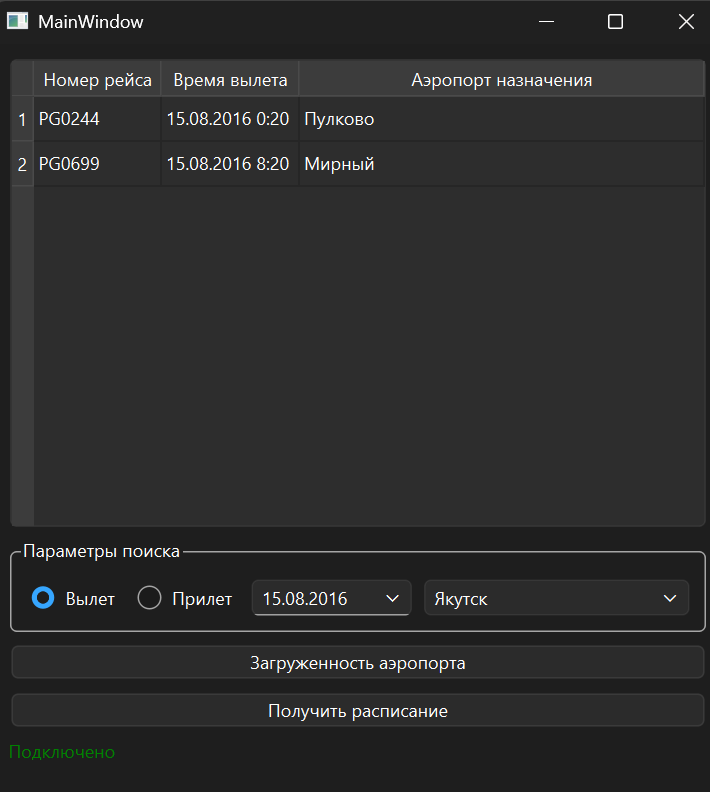
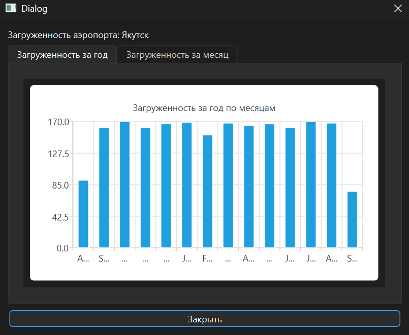
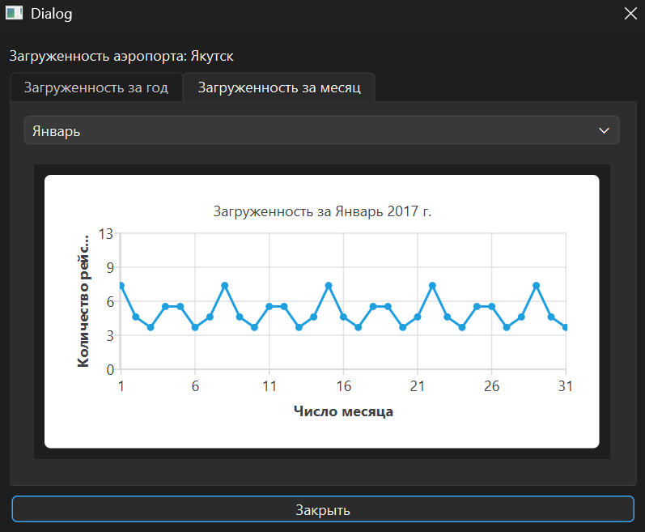

# Инспектор аэропортов

Desktop-приложение на C++/Qt 6 для просмотра расписания и загруженности аэропортов. Данные берутся из PostgreSQL — демонстрационной базы «Авиаперевозки» от Postgres Pro.

Курсовая работа по Qt (Нетология).

<p align="center">
  
</p>

<p align="center">
  
  
</p>

## Что умеет

- Показывает расписание аэропорта на выбранную дату: **вылеты** (номер рейса, время, аэропорт назначения) или **прилёты** (номер рейса, время, аэропорт отправления).
- Строит графики **загруженности** аэропорта: столбчатую диаграмму числа рейсов по месяцам за год и линейный график по дням выбранного месяца.
- Следит за подключением к базе: статус показан внизу окна, подробности ошибки — во всплывающей подсказке. Если подключиться не удалось или связь пропала во время работы, приложение повторяет попытку каждые 5 секунд, а кнопки остаются неактивными, пока не загружен список аэропортов.
- Не даёт выбрать дату вне диапазона базы (15.08.2016 – 14.09.2017), чтобы запрос не возвращал заведомо пустой результат.

## Как устроено

```
MainWindow                         StatisticsDialog (модальное окно)
├─ QSqlDatabase (драйвер QPSQL)    ├─ вкладка «Год»:   QBarSeries + QBarCategoryAxis
├─ QTimer — повтор подключения     └─ вкладка «Месяц»: QLineSeries + QValueAxis
├─ QComboBox — аэропорты (код в userData)
└─ QTableView ← QSqlQueryModel — расписание
```

**Расписание.** Запрос параметризован (`prepare` + `bindValue`), код аэропорта и дата подставляются как параметры, а не склеиваются в строку SQL. Результат отдаётся в `QSqlQueryModel`, и таблица показывает его без промежуточного копирования:

```sql
SELECT flight_no, scheduled_departure, ad.airport_name->>'ru'
FROM bookings.flights f
JOIN bookings.airports_data ad ON ad.airport_code = f.arrival_airport
WHERE f.departure_airport = :airportCode
  AND f.scheduled_departure::date = :date
```

Названия аэропортов в базе хранятся в `jsonb` с переводами (`{"en": ..., "ru": ...}`), русское название достаётся оператором `->>'ru'`.

**Статистика.** Агрегация выполняется на стороне PostgreSQL: `count(...)` с группировкой по `date_trunc('month', ...)` для годового графика и по `date_trunc('day', ...)` для месячного. Дневная статистика загружается один раз при открытии окна и хранится в памяти. При смене месяца график перестраивается из неё, без нового запроса к базе.

**Графики.** На месячном графике оси настраиваются под данные:
- верхняя граница оси Y считается от максимума;
- когда данных нет, задаётся ненулевой диапазон, иначе ось вырождается;
- точки видны всегда, чтобы были заметны месяцы с рейсами в единичные дни.

**Подключение.** Попытка подключения ограничена тремя секундами (`connect_timeout=3`): без этого libpq ждёт недоступный сервер десятки секунд, и окно всё это время не отвечает. Ошибки подключения выводятся в строку статуса, а не в `QMessageBox`. Модальное окно запускает вложенный цикл событий, в котором таймер переподключения продолжает срабатывать, и окна ошибок наслаивались бы друг на друга. Если запрос не выполнился, приложение проверяет соединение запросом `SELECT 1`. При обрыве оно уходит в переподключение, а при обычной ошибке SQL показывает сообщение.

**Интерфейс.** Формы сделаны в Qt Designer на layout'ах, окна корректно меняют размер. Переключатель «Вылет / Прилёт» собран в `QButtonGroup`.

## Сборка

Нужны:
- **Qt 6.5+** с модулями **Charts** и **Sql**;
- драйвер PostgreSQL для Qt (`QPSQL`);
- CMake 3.19+ и компилятор с C++17.

### Windows

1. В Qt Maintenance Tool установите для своего комплекта (MinGW или MSVC) компонент **Qt Charts**. Драйвер `qsqlpsql.dll` входит в Qt.
2. Драйверу нужна клиентская библиотека PostgreSQL `libpq.dll` с её зависимостями. Их можно взять из установленного PostgreSQL (`C:\Program Files\PostgreSQL\<версия>\bin`) и положить рядом с `App.exe` или добавить эту папку в `PATH`. Без них подключение падает с ошибкой «Driver not loaded».
3. Откройте `App/CMakeLists.txt` в Qt Creator, соберите и запустите.

### Linux

```bash
# Qt 6.5+ (например, из онлайн-установщика Qt) + драйвер PostgreSQL
cmake -S App -B build -DCMAKE_PREFIX_PATH=$HOME/Qt/6.8.0/gcc_64
cmake --build build -j
./build/App
```

В Ubuntu драйвер ставится пакетом `libqt6sql6-psql`, модуль графиков — `qt6-charts-dev`. Учтите, что в Ubuntu 24.04 из репозитория ставится Qt 6.4, а проекту нужен 6.5+.

### Пакет для запуска без Qt

```bash
cmake --install build --prefix dist
```

`qt_generate_deploy_app_script` скопирует в `dist` нужные библиотеки Qt и плагины. Для драйвера PostgreSQL дополнительно нужен `libpq` (см. выше).

## База данных

По умолчанию приложение подключается к учебному серверу курса. Параметры подключения заданы в конструкторе `MainWindow` (`App/mainwindow.cpp`).

Чтобы работать со своей копией:

1. Установите PostgreSQL и разверните демо-базу [«Авиаперевозки»](https://postgrespro.ru/education/demodb) **версии 15.08.2017**, вариант **big** (год данных). В более новой редакции 2025 года другие даты, и приложение на неё не рассчитано.
   ```bash
   psql -U postgres -f <SQL-файл из архива>   # создаёт базу demo со схемой bookings
   ```
2. Укажите свои хост, порт, пользователя и пароль в `MainWindow::MainWindow` и пересоберите.

## Ограничения

- Параметры подключения зашиты в код. Нет файла настроек или переменных окружения.
- Подключение выполняется в потоке интерфейса: пока идёт попытка (не дольше 3 секунд), окно не отвечает.
- Обрыв связи замечается при следующем запросе, а не сразу.
- Вкладка «Месяц» показывает 12 месяцев с сентября 2016 по август 2017. Неполные август 2016 и сентябрь 2017 в выборку не попадают.
- Даты рейсов группируются в часовом поясе сервера, а не по местному времени аэропорта.
- Проверено на Windows. CMake-проект переносимый, но под Linux и macOS отдельно не тестировался.

## Структура

```
App/
├── CMakeLists.txt
├── main.cpp
├── mainwindow.{h,cpp,ui}        главное окно: подключение, аэропорты, расписание
└── statisticsdialog.{h,cpp,ui}  окно статистики с графиками Qt Charts
```

## Стек

C++17, Qt 6 (Widgets, Sql, Charts), PostgreSQL, CMake, Qt Designer.
